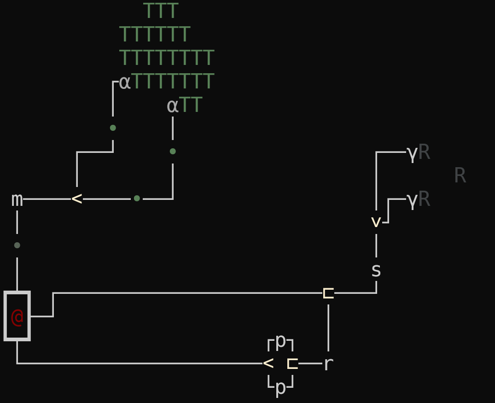
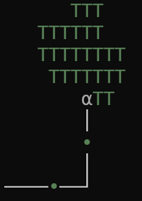
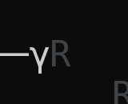
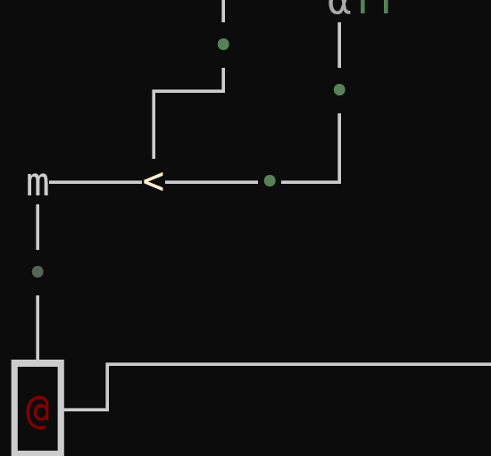
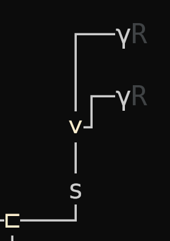
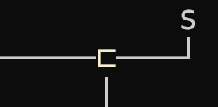
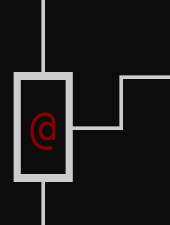
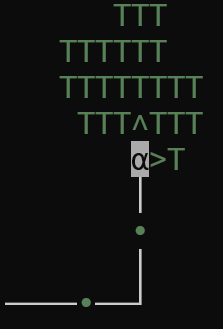
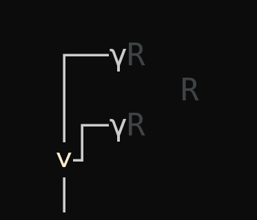
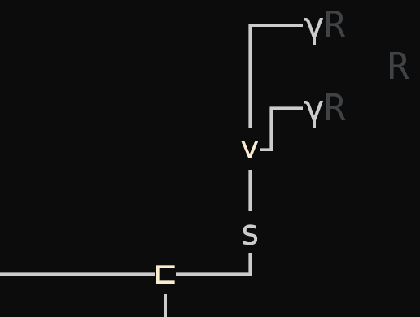

# terminal-tower-defense (ttd) Design Document

## Game Mechanics
- **Tower Defense**: Players place towers to defend against waves of enemies.
- **Factory Simulation**: Players build and manage production lines to create resources needed for defense.

## Visuals
- Utilizes VT-100 escape sequences for rendering graphics in the terminal.
- ASCII art for towers, enemies, and the factory components.

## Interactions
- Command-line based interactions.
- Real-time updates in the terminal window.

## CLI Command Structure

General Command Format:

```bash
> ttd [command] [subcommand] [options]
```

### Factory

```bash
> ttd factory [command] [options]
```

#### Show

```bash
> ttd factory show
```

Shows the current factory map. 

- Options:
  - `-s`, `--stream`: Continuously update the factory map.
  - `-l`, `--level` `<level>`: Show the factory map at a specific level (default: 0).

#### Build

```bash
> ttd factory build [building] [x] [y]
```

Builds a building at the specified location.

- Options:
  - `building`: The building to build.
  - `x`: The x-coordinate of the building.
  - `y`: The y-coordinate of the building.

#### Analyze

```bash
> ttd factory analyze
```

Analyzes the factory map to determine if the production line is efficient.

- Options:
  - `--at` `<x> <y>`: Analyze the tile at the specified location.

### Resources

```bash
> ttd resources [command] [options]
```

#### Show

```bash
> ttd resources show
```

Shows the current resources, production rates, and storage levels.

- Options:
  - `-s`, `--stream`: Continuously update the resource information.
  - `-la`, `--list-all`: Show all resources, including those with zero production.

#### Tree

```bash
> ttd resources tree [resource]
```

Shows the production tree for the specified resource.

- Options:
  - `resource`: The resource to show the production tree for.
  - `-f`, `--from`: Only show the tree down from the specified resource.
  - `-t`, `--to`: Only show the tree up to the specified resource.

## Graphics Guide Factory

Example of a simple factory layout:



### Ressources

Ressources in general are represented by a capital latin letter with a distinct foreground color.

#### Wood

| Property | Value |
| -------- | ----- |
| Symbol   | `T`   |



#### Iron

| Property | Value |
| -------- | ----- |
| Symbol   | `R`   |



### Buildings

#### Transportation

Transportation buildings are represented by a symbol with a distinct foreground color.

##### Conveyor Belts

| Property | Value                         |
| -------- | ----------------------------- |
| Symbols  | `│`, `─`, `┌`, `┐`, `└`, `┘`, |



##### Merger

| Property | Value |
| -------- | ----- |
| Symbol   | `<`, `>`, `^`, `v` |



##### Splitter

| Property | Value              |
| -------- | ------------------ |
| Symbol   | `⊏`, `⊐`, `⊓`, `⊔` |



#### Base

The base is represented by the symbol `@` and is enclosed in a thick border for connection to the transportation system.

| Property | Value |
| -------- | ----- |
| Symbol   | `@`   |




#### Production

Production buildings are represented by a greek lowercase letter with a distinct foreground color.

##### Lumberjack

| Property | Value |
| -------- | ----- |
| Symbol   | `α`   |



##### Iron Mine

| Property | Value |
| -------- | ----- |
| Symbol   | `γ`   |



#### Processing and Crafting

Processing and crafting buildings are represented by lowercase latin letters with a distinct foreground color.

##### Smelter

| Property | Value |
| -------- | ----- |
| Symbol   | `s`   |

